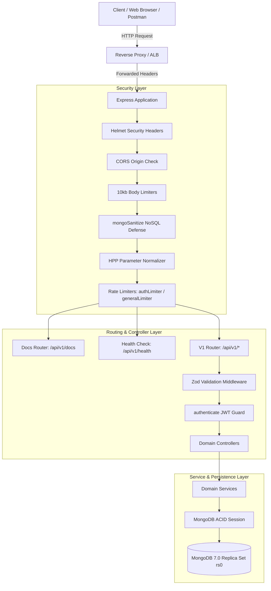
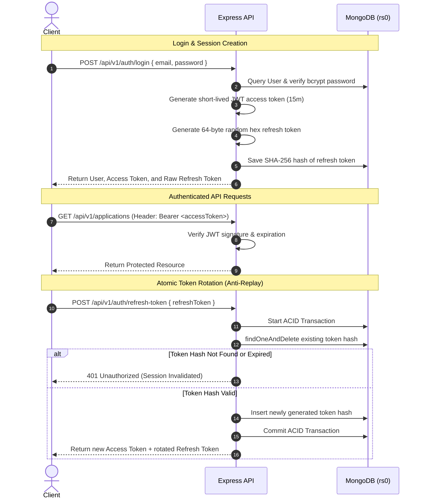
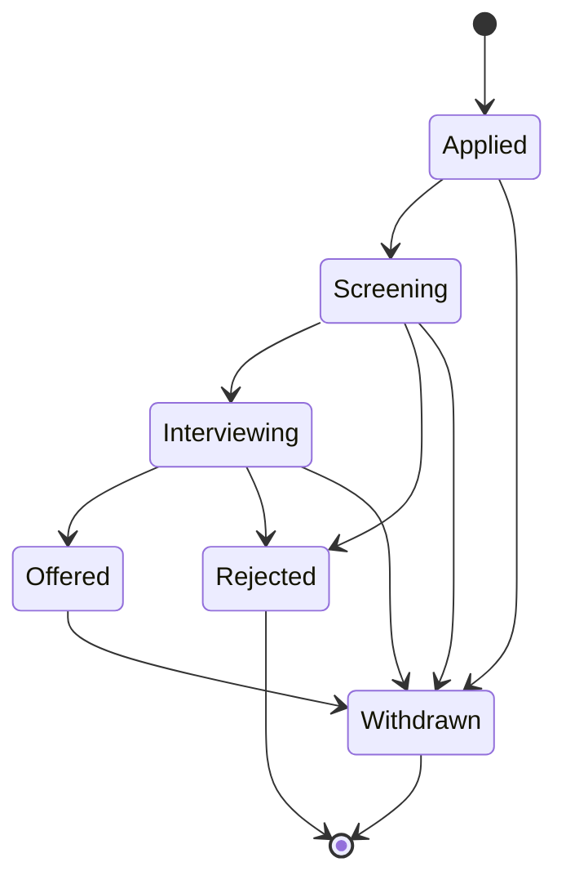

# Job Application Tracker API

[](https://github.com/shaikh/job-application-tracker-api/actions)
[](https://nodejs.org/)
[](https://www.mongodb.com/)
[](https://opensource.org/licenses/ISC)

A production-grade, enterprise-ready RESTful API for tracking job applications, scheduling interviews, managing user profiles, and computing career transition analytics. Engineered with strict multi-document ACID transactions, robust NoSQL injection defense, fine-grained IDOR protection, deterministic finite state machines, and complete OpenAPI/Swagger documentation.

---

## Table of Contents

1. [Project Overview](#1-project-overview)
2. [Core Features](#2-core-features)
3. [Technology Stack](#3-technology-stack)
4. [System Architecture](#4-system-architecture)
5. [Project Directory Structure](#5-project-directory-structure)
6. [Authentication & Session Lifecycle](#6-authentication--session-lifecycle)
7. [Finite State Machines (FSM)](#7-finite-state-machines-fsm)
8. [API Endpoint Inventory](#8-api-endpoint-inventory)
9. [Security Hardening](#9-security-hardening)
10. [Database Architecture & Indexes](#10-database-architecture--indexes)
11. [Environment Variables](#11-environment-variables)
12. [Local Development Setup](#12-local-development-setup)
13. [MongoDB Replica Set Requirement](#13-mongodb-replica-set-requirement)
14. [Docker Containerization](#14-docker-containerization)
15. [Docker Compose Deployment](#15-docker-compose-deployment)
16. [Running Automated Tests](#16-running-automated-tests)
17. [Code Quality & Linting](#17-code-quality--linting)
18. [Interactive API Documentation (Swagger UI)](#18-interactive-api-documentation-swagger-ui)
19. [Postman Collection & Environment](#19-postman-collection--environment)
20. [GitHub Actions CI/CD](#20-github-actions-cicd)
21. [Troubleshooting & FAQ](#21-troubleshooting--faq)

---

## 1. Project Overview

The **Job Application Tracker API** provides job seekers with a secure, dependable backend to record, manage, and analyze their end-to-end recruitment funnel. Unlike rudimentary CRUD apps, this system enforces:
- **Strict User Isolation & IDOR Defense**: All database operations verify resource ownership.
- **ACID Multi-Document Transactions**: Deletions, status transitions, and credential rotations execute atomically.
- **State Machine Integrity**: Applications and interviews transition strictly through predefined status workflows.
- **Career Analytics**: Generates real-time overview metrics, status distributions, conversion funnels, and continuous monthly trends without division-by-zero errors.

---

## 2. Core Features

- **Authentication & Identity**: Short-lived JWT access tokens + opaque, rotating refresh tokens stored as SHA-256 digests in MongoDB with anti-replay detection.
- **User Profile Management**: Authenticated profile viewing, controlled profile updates, and transactional password changes with atomic cross-device session revocation.
- **Job Application Tracking**: Comprehensive application recording with full-text search, multi-field filtering, sorting, pagination, and soft-archive toggling.
- **Interview Scheduling**: Round scheduling, automated double-booking conflict prevention, date range filtering, and route-precedence-safe upcoming queries.
- **Atomic Cascade Cleanup**: Hard deletion of a job application atomically deletes all associated interviews inside an isolated transaction.
- **Advanced Funnel Analytics**: Aggregations calculating interview rates, offer conversion rates, and continuous UTC chronological application counts.
- **Production Defense Stack**: Native recursive NoSQL sanitization, HTTP Parameter Pollution normalization, Helmet security headers, CORS origin locking, 10kb body payload limits, and dual-tier rate limiting.

---

## 3. Technology Stack

- **Runtime**: Node.js $\ge 20$ (Native ECMAScript Modules)
- **Web Framework**: Express 4.21
- **Database**: MongoDB Community Edition 7.0 LTS
- **Object Modeling**: Mongoose 8.9.5
- **Input Validation**: Zod 3.24
- **Security**: Helmet 8.0, CORS 2.8, HPP 0.2, bcrypt 5.1, jsonwebtoken 9.0, express-rate-limit 7.5
- **Testing**: Jest 29.7, Supertest 7.0, mongodb-memory-server 10.1 (with in-memory replica sets)
- **Documentation**: OpenAPI 3.0.3, Swagger UI Express 5.0
- **Containerization & CI**: Docker (multi-stage Alpine), Docker Compose, GitHub Actions

---

## 4. System Architecture



---

## 5. Project Directory Structure

```text
job-application-tracker-api/
├── .github/
│   └── workflows/
│       └── ci.yml               # GitHub Actions CI workflow
├── postman/
│   ├── Job_Tracker_API.postman_collection.json
│   └── Local_Dev.postman_environment.json
├── src/
│   ├── config/
│   │   ├── db.js                # Mongoose connection with pooling options
│   │   └── env.js               # Zod-validated environment schema
│   ├── constants/
│   │   ├── applicationStatus.js # Application statuses, enums, and FSM rules
│   │   └── interviewStatus.js   # Interview statuses, enums, and FSM rules
│   ├── controllers/
│   │   ├── analytics.controller.js
│   │   ├── application.controller.js
│   │   ├── auth.controller.js
│   │   ├── interview.controller.js
│   │   └── user.controller.js
│   ├── docs/
│   │   └── swagger.json         # OpenAPI 3.0.3 static specification
│   ├── middlewares/
│   │   ├── auth.middleware.js   # JWT bearer token verification
│   │   ├── error.middleware.js  # Operational error handler
│   │   ├── mongoSanitize.middleware.js # Native recursive NoSQL sanitization
│   │   ├── rateLimiter.middleware.js   # Auth and general IP rate limiters
│   │   └── validate.middleware.js      # Zod schema validation wrapper
│   ├── models/
│   │   ├── JobApplication.js    # Job application Mongoose schema
│   │   ├── Interview.js         # Interview Mongoose schema
│   │   ├── RefreshToken.js      # Opaque token hash Mongoose schema
│   │   └── User.js              # User Mongoose schema
│   ├── routes/
│   │   └── v1/
│   │       ├── analytics.routes.js
│   │       ├── application.routes.js
│   │       ├── auth.routes.js
│   │       ├── docs.routes.js   # Swagger UI and spec routes
│   │       ├── index.js         # V1 central router
│   │       ├── interview.routes.js
│   │       └── user.routes.js
│   ├── services/
│   │   ├── analytics.service.js
│   │   ├── application.service.js
│   │   ├── auth.service.js
│   │   ├── interview.service.js
│   │   └── user.service.js
│   ├── utils/
│   │   ├── ApiError.js          # Operational error class
│   │   ├── ApiResponse.js        # Standard success response envelope
│   │   ├── catchAsync.js        # Async controller error wrapper
│   │   └── token.util.js        # Crypto utilities for JWTs and SHA-256 tokens
│   ├── app.js                   # Express application setup and middleware chain
│   └── server.js                # Server entry point with idempotent graceful shutdown
├── tests/
│   ├── applications/
│   │   └── applications.test.js # Phase 3 application and IDOR tests
│   ├── auth/
│   │   └── auth.test.js         # Phase 2 authentication tests
│   ├── analytics.test.js        # Phase 5 analytics tests
│   ├── foundation.test.js       # Phase 1 foundation smoke tests
│   ├── interviews.test.js       # Phase 4 interview & cascade deletion tests
│   ├── production.test.js       # Phase 6 production, Swagger, and health tests
│   ├── security.test.js         # Phase 5 security hardening tests
│   ├── setup.js                 # MongoMemoryReplSet test lifecycle
│   └── users.test.js            # Phase 5 user profile & transaction tests
├── .dockerignore
├── .env.example
├── .gitignore
├── docker-compose.yml
├── Dockerfile
├── eslint.config.js
├── jest.config.js
├── package.json
└── README.md
```

---

## 6. Authentication & Session Lifecycle



---

## 7. Finite State Machines (FSM)

### Application Status FSM

Applications strictly transition according to predefined progression rules:



| Current Status | Allowed Target Statuses | Terminal State? |
|---|---|---|
| `Applied` | `Screening`, `Withdrawn` | No |
| `Screening` | `Interviewing`, `Rejected`, `Withdrawn` | No |
| `Interviewing` | `Offered`, `Rejected`, `Withdrawn` | No |
| `Offered` | `Withdrawn` | No |
| `Rejected` | None | **Yes** |
| `Withdrawn` | None | **Yes** |

### Interview Status FSM

Interviews maintain an independent lifecycle that does not mutate the parent application status:

| Current Status | Allowed Target Statuses | Terminal State? |
|---|---|---|
| `Scheduled` | `Completed`, `Rescheduled`, `Cancelled`, `No Show` | No |
| `Rescheduled` | `Completed`, `Rescheduled`, `Cancelled`, `No Show` | No |
| `No Show` | `Rescheduled`, `Cancelled` | No |
| `Completed` | None | **Yes** |
| `Cancelled` | None | **Yes** |

---

## 8. API Endpoint Inventory

The API provides **24 domain endpoints**, **1 infrastructure health endpoint**, and **2 documentation infrastructure routes** (Total: **27 HTTP routes**).

### Locked Domain & Infrastructure Endpoints (25)

| # | Domain | Method | Endpoint Path | Auth | Description |
|---|---|---|---|---|---|
| 1 | Utility | `GET` | `/api/v1/health` | No | Server health and operational status |
| 2 | Auth | `POST` | `/api/v1/auth/register` | No | Create user account |
| 3 | Auth | `POST` | `/api/v1/auth/login` | No | Authenticate user and receive token pair |
| 4 | Auth | `POST` | `/api/v1/auth/refresh-token` | No | Rotate refresh token (anti-replay) |
| 5 | Auth | `POST` | `/api/v1/auth/logout` | No | Revoke active refresh token session |
| 6 | Users | `GET` | `/api/v1/users/me` | Yes | Retrieve authenticated user profile |
| 7 | Users | `PATCH` | `/api/v1/users/me` | Yes | Update profile allowed fields |
| 8 | Users | `PATCH` | `/api/v1/users/change-password` | Yes | Change password & revoke all sessions |
| 9 | Applications | `POST` | `/api/v1/applications` | Yes | Create job application |
| 10 | Applications | `GET` | `/api/v1/applications` | Yes | List applications (search, filter, sort, paginate) |
| 11 | Applications | `GET` | `/api/v1/applications/:id` | Yes | Get application by ID with interviews |
| 12 | Applications | `PATCH` | `/api/v1/applications/:id` | Yes | Update application details or status |
| 13 | Applications | `PATCH` | `/api/v1/applications/:id/archive` | Yes | Toggle application archive status |
| 14 | Applications | `DELETE` | `/api/v1/applications/:id` | Yes | Hard delete application & cascade interviews |
| 15 | Interviews | `POST` | `/api/v1/applications/:applicationId/interviews` | Yes | Schedule interview on application |
| 16 | Interviews | `GET` | `/api/v1/applications/:applicationId/interviews` | Yes | List interviews for specific application |
| 17 | Interviews | `GET` | `/api/v1/interviews` | Yes | Global user interview list |
| 18 | Interviews | `GET` | `/api/v1/interviews/upcoming` | Yes | List upcoming interviews (default 7 days) |
| 19 | Interviews | `GET` | `/api/v1/interviews/:id` | Yes | Get single interview by ID |
| 20 | Interviews | `PATCH` | `/api/v1/interviews/:id` | Yes | Update interview details or status |
| 21 | Interviews | `DELETE` | `/api/v1/interviews/:id` | Yes | Delete individual interview |
| 22 | Analytics | `GET` | `/api/v1/analytics/overview` | Yes | High-level metrics & interview rates |
| 23 | Analytics | `GET` | `/api/v1/analytics/status-breakdown` | Yes | Breakdown by status, priority, type |
| 24 | Analytics | `GET` | `/api/v1/analytics/conversion-rates` | Yes | Funnel conversion stage rates |
| 25 | Analytics | `GET` | `/api/v1/analytics/monthly-trends` | Yes | Chronological UTC trend with zero-backfill |

### Documentation Infrastructure Routes (2)

| # | Type | Method | Endpoint Path | Auth | Description |
|---|---|---|---|---|---|
| 26 | Documentation | `GET` | `/api/v1/docs/` | No | Interactive Swagger UI documentation |
| 27 | Documentation | `GET` | `/api/v1/docs/swagger.json` | No | Raw OpenAPI 3.0.3 JSON specification |

---

## 9. Security Hardening

- **Native NoSQL Sanitization**: Custom middleware inspects `req.body`, `req.query`, and `req.params`. Keys starting with `$` or containing `.`, as well as prototype-pollution keys (`__proto__`, `constructor`, `prototype`), are rejected with controlled `400 Bad Request` errors. Legitimate values containing `$` (e.g. salary `$150,000`) and `.` (e.g. email or URL) are fully preserved.
- **HTTP Parameter Pollution (HPP)**: `hpp()` middleware normalizes repeated query parameters, preventing array-injection attacks from bypassing scalar validators.
- **Dual-Tier Rate Limiting**:
  - `authLimiter`: 20 requests per 15 minutes per IP on `/register` and `/login`.
  - `generalLimiter`: 200 requests per 15 minutes per IP across all `/api/v1/*` routes.
- **Strict Payload Limits**: `express.json({ limit: '10kb' })` and `express.urlencoded({ limit: '10kb' })` protect against denial-of-service memory exhaustion.
- **Sensitive Data Exclusion**: Mongoose schemas mark `password: { select: false }`. Auth utilities explicitly delete password properties prior to response dispatch. Raw refresh tokens exist only in memory during token issuance; only SHA-256 token digests are persisted.

---

## 10. Database Architecture & Indexes

### Collections
1. **`users`**: User identity, credential hash, headline, target role, timestamps.
2. **`jobapplications`**: Application record, user reference, company, position, status, priority, jobType, workplaceType, salary, location, archive flag, timestamps.
3. **`interviews`**: Interview record, application reference, user reference, round, interviewDate, durationMinutes, status, location, notes, timestamps.
4. **`refreshtokens`**: Session records storing SHA-256 token hashes, user references, and TTL expiration dates.

### Production Indexes
- **`jobapplications`**:
  - Compound Index: `{ userId: 1, isArchived: 1, appliedDate: -1 }` (powers filtered application lists and analytics aggregation pipelines without COLLSCAN).
  - Compound Index: `{ userId: 1, status: 1 }` (powers status filtering).
  - Compound Text Index: `{ company: 'text', position: 'text', notes: 'text' }` (powers full-text keyword searches).
- **`interviews`**:
  - Compound Index: `{ userId: 1, interviewDate: 1 }` (powers upcoming and range-filtered interview queries).
  - Compound Index: `{ applicationId: 1, interviewDate: 1 }` (powers nested interview lookups).
- **`refreshtokens`**:
  - Unique Index: `{ tokenHash: 1 }` (powers fast, atomic session lookups).
  - TTL Index: `{ expiresAt: 1 }` with expiration cleanup.

---

## 11. Environment Variables

All environment variables are strictly validated on startup using Zod in `src/config/env.js`:

| Variable | Type | Default | Required in Prod? | Description |
|---|---|---|---|---|
| `NODE_ENV` | Enum | `development` | Yes | Environment mode (`development`, `production`, `test`) |
| `PORT` | Number | `5000` | No | HTTP port for Express server |
| `MONGO_URI` | String | *None* | **Yes** | MongoDB connection URI (**must include `replicaSet=rs0`**) |
| `JWT_ACCESS_SECRET` | String | *None* | **Yes** | Secret for signing JWT access tokens (min 32 characters) |
| `CLIENT_URL` | String | `http://localhost:3000` | Yes | Allowed frontend origin for CORS policies |
| `TRUST_PROXY` | String | `false` | When behind proxy | Reverse proxy hop count or boolean (`false`, `true`, `1`) |
| `DB_MAX_POOL_SIZE` | Number | `50` | No | Initial maximum MongoDB connection pool size |
| `DB_MIN_POOL_SIZE` | Number | `5` | No | Initial minimum pre-warmed connection pool size |
| `DB_SERVER_SELECTION_TIMEOUT_MS` | Number | `5000` | No | Timeout for MongoDB primary selection |
| `DB_SOCKET_TIMEOUT_MS` | Number | `45000` | No | Inactive socket timeout in milliseconds |

---

## 12. Local Development Setup

### Prerequisites
- **Node.js**: Version $\ge 20.0.0$
- **MongoDB**: Version $\ge 7.0$ running as a **replica set** (see Section 13)

### Installation Steps
```bash
# 1. Clone repository
git clone https://github.com/shaikh/job-application-tracker-api.git
cd job-application-tracker-api

# 2. Install dependencies
npm install

# 3. Create local environment file
cp .env.example .env

# 4. Configure .env with your local secrets
# Ensure MONGO_URI points to your replica set:
# MONGO_URI=mongodb://localhost:27017/job-tracker?replicaSet=rs0
# JWT_ACCESS_SECRET=your-super-secret-jwt-access-key-minimum-32-characters-long

# 5. Start development server with file watching
npm run dev
```

The API will boot at `http://localhost:5000`.

---

## 13. MongoDB Replica Set Requirement

### Why a Replica Set is Mandatory
The Job Application Tracker API relies on multi-document ACID transactions (`mongoose.startSession()` and `session.startTransaction()`) to guarantee data integrity across cascading interview deletions, token rotation, and password resets. In MongoDB, transactions are supported **only** on replica sets or sharded clusters.

### Local Replica Set Setup (Standalone MongoDB)
If running a native local MongoDB server without Docker, start it with the `--replSet` flag:
```bash
mongod --dbpath /data/db --replSet rs0 --bind_ip_all
```
Then initiate the replica set once via `mongosh`:
```javascript
rs.initiate({
  _id: "rs0",
  members: [{ _id: 0, host: "localhost:27017" }]
});
```

---

## 14. Docker Containerization

The project includes a multi-stage, production-hardened `Dockerfile` built on Node 20 Alpine.

### Build and Run Image
```bash
# Build production image
docker build -t job-application-tracker-api .

# Run standalone container
docker run -p 5000:5000 \
  -e NODE_ENV=production \
  -e PORT=5000 \
  -e MONGO_URI=mongodb://host.docker.internal:27017/job-tracker?replicaSet=rs0 \
  -e JWT_ACCESS_SECRET=your-32-char-minimum-production-access-key! \
  -e CLIENT_URL=http://localhost:3000 \
  job-application-tracker-api
```

---

## 15. Docker Compose Deployment

The fastest, zero-configuration method to run the complete stack—including an automatically initialized MongoDB replica set—is Docker Compose.

```bash
# Start API and MongoDB replica set
docker compose up --build

# Run in detached background mode
docker compose up -d

# View service logs
docker compose logs -f api

# Stop and remove containers (data persists in mongo_data volume)
docker compose down

# Stop and wipe database volume
docker compose down -v
```

---

## 16. Running Automated Tests

The test suite uses `mongodb-memory-server` with `MongoMemoryReplSet` to spin up an isolated, in-memory wiredTiger replica set. No external database is required to run the tests.

```bash
# Execute full test suite (all 128 tests across 8 suites)
npm test

# Run a specific test suite
npm test -- tests/production.test.js
npm test -- tests/applications/applications.test.js
```

### Test Suite Distribution
- `tests/foundation.test.js`: Health check, 404, ApiError/ApiResponse utilities (5 tests)
- `tests/auth/auth.test.js`: Registration, login, token rotation, anti-replay, logout (21 tests)
- `tests/applications/applications.test.js`: CRUD, IDOR, pagination, text search, FSM, compound indexes (31 tests)
- `tests/interviews.test.js`: Double-booking conflicts, FSM, upcoming filters, cascade deletion (32 tests)
- `tests/analytics.test.js`: Overview metrics, status breakdown, conversion funnels, zero-division safety, UTC monthly trends (9 tests)
- `tests/users.test.js`: Profile retrieval, protected field rejection, transactional password changes (14 tests)
- `tests/security.test.js`: NoSQL injection rejection, HPP normalization, rate limiting, 10kb body limits, Helmet headers (12 tests)
- `tests/production.test.js`: Swagger UI availability, OpenAPI JSON validity, health check, environment parsing (4 tests)

**Total: 128 / 128 tests passing (100% passing)**.

---

## 17. Code Quality & Linting

The repository uses ESLint 9 with flat configuration (`eslint.config.js`):
```bash
# Check for lint errors
npm run lint

# Automatically fix autofixable formatting/lint issues
npm run lint:fix
```

Current status: **0 errors, 0 warnings**.

---

## 18. Interactive API Documentation (Swagger UI)

Once the server is running, navigate in your browser to:
```
http://localhost:5000/api/v1/docs
```

- **Interactive UI**: Test endpoints directly from the browser using the **Authorize** button with a Bearer JWT token.
- **Raw Specification**: Access the raw OpenAPI 3.0.3 specification at:
  ```
  http://localhost:5000/api/v1/docs/swagger.json
  ```

---

## 19. Postman Collection & Environment

Pre-configured Postman assets are located in the `/postman` directory:
- `Job_Tracker_API.postman_collection.json`: Contains 25 structured requests across 6 folders covering all domain endpoints. Includes test scripts for automatic extraction and rotation of access/refresh tokens and auto-population of `applicationId` and `interviewId`.
- `Local_Dev.postman_environment.json`: Environment file configured with `baseUrl: http://localhost:5000/api/v1`.

### Import Instructions
1. Open Postman.
2. Click **Import** and select both files from the `/postman` directory.
3. Select the **Local Dev** environment in the top-right dropdown.
4. Execute `Register User` or `Login User`—tokens will automatically populate into your environment.

---

## 20. GitHub Actions CI/CD

The CI pipeline runs on every `push` and `pull_request` targeting the `main` branch via `.github/workflows/ci.yml`.

### Pipeline Stages
1. **Checkout Code**: Checks out the repository using `actions/checkout@v4`.
2. **Setup Node.js**: Configures Node.js 20 with npm caching via `actions/setup-node@v4`.
3. **Install Dependencies**: Performs deterministic installation via `npm ci`.
4. **Code Quality**: Executes `npm run lint` (fails on any error or warning).
5. **Test Suite**: Executes `npm test` across all 128 integration tests using in-memory MongoDB replica sets.

---

## 21. Troubleshooting & FAQ

### 1. `Transaction numbers are only allowed on a replica set member or mongos`
- **Cause**: The application is connecting to a standalone MongoDB instance rather than a replica set.
- **Fix**: Run MongoDB with `--replSet rs0` and run `rs.initiate()`, or start the database using `docker compose up`.

### 2. `Rate limit exceeded` during local testing
- **Cause**: Sending more than 20 requests to `/register` or `/login` in a 15-minute window from the same IP.
- **Fix**: Wait 15 minutes for the window to reset, or run tests using `npm test` (tests automatically bypass production rate limiters via test environment detection).

### 3. Rate limiter throttles all users in production
- **Cause**: Application is running behind a reverse proxy (e.g. Nginx, ALB, Cloudflare) without `TRUST_PROXY` enabled, causing all client requests to share the proxy IP.
- **Fix**: Set `TRUST_PROXY=1` (or `true`) in your production environment variables.

### 4. `Unrecognized or protected fields in profile update payload`
- **Cause**: Attempting to update `email`, `password`, `role`, or `_id` via `PATCH /api/v1/users/me`.
- **Fix**: The profile update endpoint strictly permits only `name`, `headline`, and `targetRole`. Use `PATCH /api/v1/users/change-password` to update passwords.

---

## License

This project is licensed under the [ISC License](LICENSE).